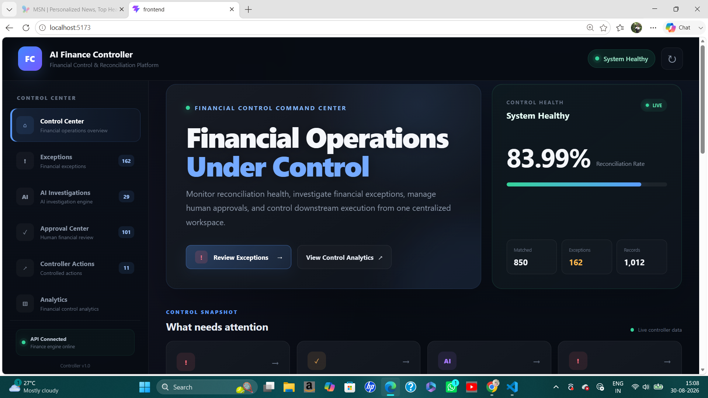
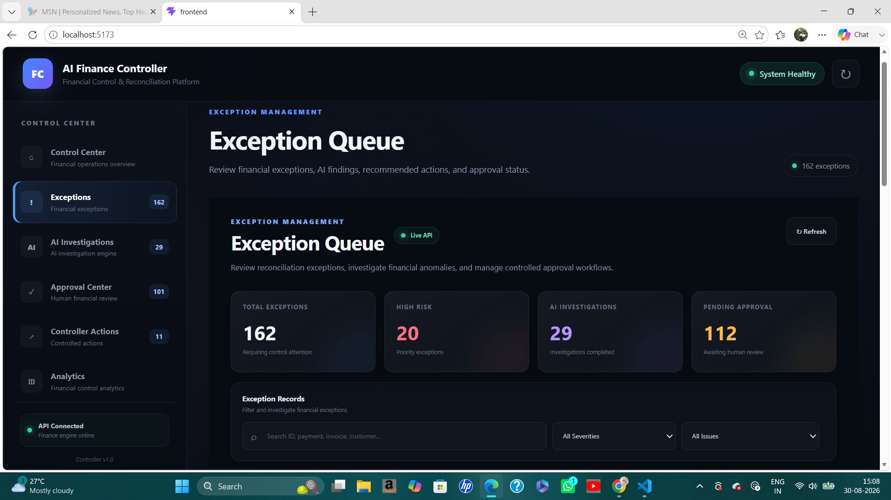
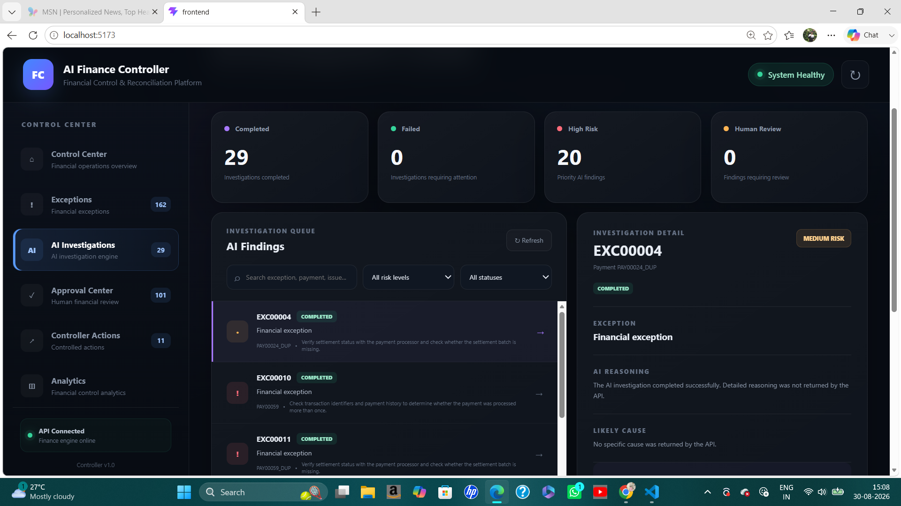
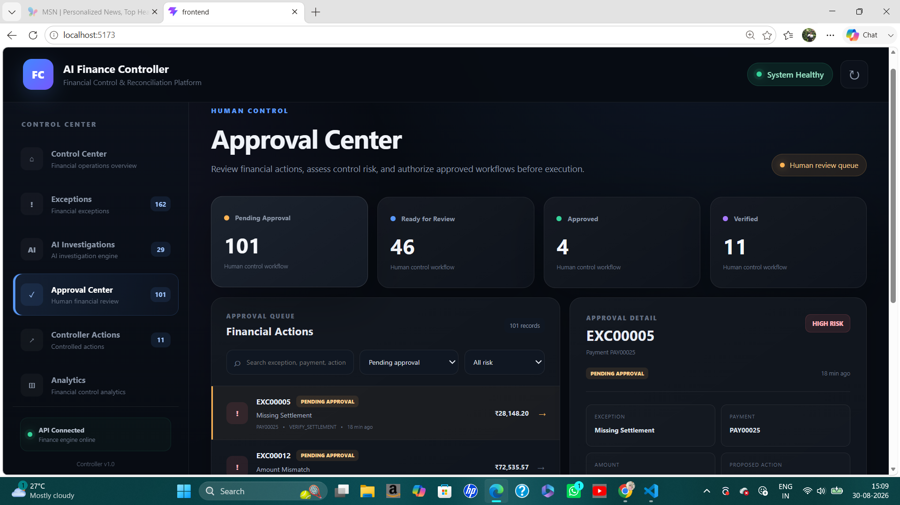
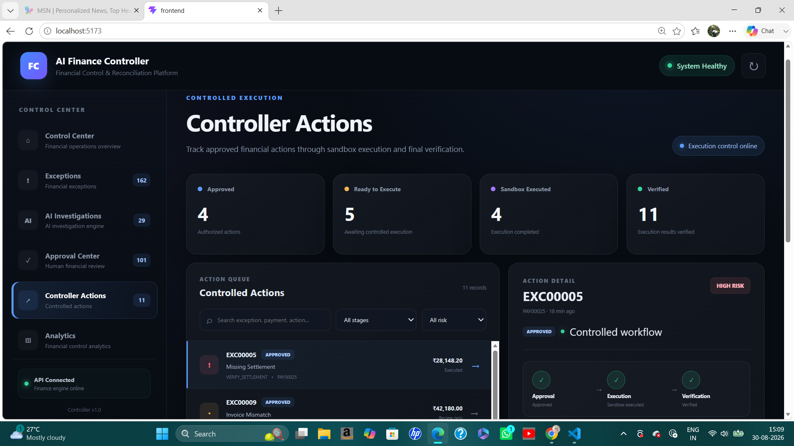
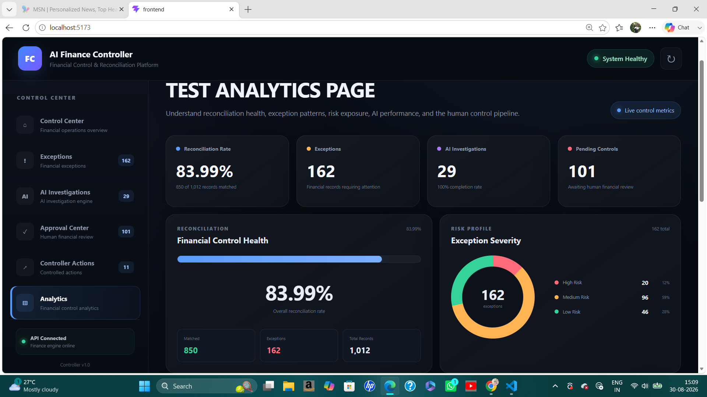

# AI Finance Controller

### AI-Powered Financial Reconciliation, Exception Investigation & Controlled Automation

AI Finance Controller is an intelligent financial operations system designed to detect reconciliation exceptions, investigate them using AI, assess risk, and safely manage financial actions through a human-in-the-loop approval workflow.

The project focuses on a key principle for financial automation:

> **AI can assist financial decision-making, but sensitive financial actions should remain controlled, auditable, and verifiable.**

---

## Overview

Modern payment and financial systems process large volumes of transactions, payments, invoices, and settlements. Identifying discrepancies and investigating financial exceptions manually can be time-consuming and operationally expensive.

**AI Finance Controller** provides an end-to-end workflow for managing these exceptions.

The system combines deterministic financial reconciliation with AI-assisted investigation and controlled automation to help transform raw financial discrepancies into structured, actionable workflows.

### Core capabilities

- Automated financial reconciliation
- Exception detection and classification
- AI-powered investigation
- Financial context analysis
- Risk-based decision making
- Human-in-the-loop approval
- Controlled action execution
- Sandbox-based financial operations
- Automatic execution verification
- Analytics and operational monitoring

---

# Problem Statement

Financial operations teams frequently need to investigate issues such as:

- Missing settlements
- Payment mismatches
- Invoice differences
- Settlement delays
- Transaction discrepancies
- Reconciliation exceptions

A typical investigation may require manually identifying related records, analyzing financial evidence, determining the likely cause, deciding on the next action, obtaining approval, and verifying the final result.

As transaction volume increases, this workflow becomes increasingly repetitive and difficult to manage efficiently.

The objective of this project is to build an intelligent financial controller that can automate the investigation and workflow management process while maintaining appropriate controls over sensitive financial actions.

---

# Our Approach

The project follows a **controlled AI-assisted financial operations architecture**.

Instead of allowing an AI model to directly perform financial operations, the system separates intelligence, decision-making, approval, execution, and verification into independent stages.

```text
Financial Data
      ↓
Validation & Normalization
      ↓
Reconciliation Engine
      ↓
Exception Detection
      ↓
AI Investigation
      ↓
Risk Assessment
      ↓
Controller Decision
      ↓
Human Approval
      ↓
Controlled Execution
      ↓
Automatic Verification
```

This architecture ensures that AI acts as an **investigation and recommendation layer**, while sensitive actions remain protected by deterministic controls and approval mechanisms.

---

# Key Features

## Financial Reconciliation

The reconciliation engine compares related financial records and identifies inconsistencies across payments, invoices, settlements, and transactions.

The system can detect financial issues such as:

- Missing settlements
- Payment discrepancies
- Invoice differences
- Settlement mismatches
- Delayed settlements

Detected issues are converted into structured exceptions that can be tracked throughout the workflow.

---

## AI-Powered Investigation

The AI investigation layer analyzes the available financial context associated with an exception.

It generates structured insights including:

- Investigation summary
- Likely cause
- Recommended action
- Risk-related information

This allows financial exceptions to move from simple discrepancy detection toward contextual investigation and actionable recommendations.

---

## Risk-Based Controller

The controller evaluates each exception and determines the appropriate workflow.

The decision process considers information such as:

- Exception severity
- Financial risk
- Controller priority
- Proposed action
- Approval requirements
- Execution permissions

This creates a controlled separation between **AI recommendations** and **actual financial actions**.

---

## Human-in-the-Loop Approval

Sensitive actions are protected through an approval workflow.

Actions that require review cannot proceed directly to execution.

The workflow supports controlled states such as:

```text
PENDING_APPROVAL
        ↓
APPROVED
        ↓
EXECUTION_ALLOWED
```

This ensures that important financial actions remain under human supervision.

---

## Controlled Sandbox Execution

Approved actions are executed through a dedicated Finance Sandbox environment.

The sandbox simulates controlled financial operations without interacting with real financial systems.

This allows the complete automation workflow to be tested safely, including:

- Action execution
- Settlement verification
- Execution responses
- Failure handling
- Workflow state updates

---

## Automatic Verification

Execution is not considered complete simply because an action request succeeds.

The system verifies the execution result and updates the workflow accordingly.

A successful controlled workflow follows:

```text
PENDING_APPROVAL
        ↓
APPROVED
        ↓
SANDBOX_EXECUTED
        ↓
SANDBOX_VERIFIED
```

This provides a clear and traceable lifecycle for financial actions.

---

# End-to-End Workflow

```text
1. Financial records enter the system

2. Data is validated and normalized

3. The reconciliation engine compares related records

4. Financial discrepancies are detected

5. Exceptions are created and classified

6. AI investigates the financial context

7. The controller evaluates risk and proposes an action

8. Sensitive actions require human approval

9. Approved actions are executed in a controlled sandbox

10. Execution results are automatically verified
```

---

# System Architecture

```text
                    ┌─────────────────────┐
                    │    React Frontend   │
                    │  Financial Control  │
                    │      Dashboard      │
                    └──────────┬──────────┘
                               │
                               ▼
                    ┌─────────────────────┐
                    │    Backend API      │
                    │       Flask         │
                    └──────────┬──────────┘
                               │
                               ▼
        ┌────────────────────────────────────────┐
        │          AI Finance Controller          │
        │                                        │
        │  Reconciliation Engine                 │
        │  Exception Detection                   │
        │  AI Investigation                      │
        │  Risk Assessment                       │
        │  Approval Engine                       │
        │  Execution Engine                      │
        └───────────────────┬────────────────────┘
                            │
                            ▼
                  ┌───────────────────┐
                  │ Finance Sandbox   │
                  │ Controlled Actions│
                  │ Verification      │
                  └───────────────────┘
```

---

# Application Screenshots

## Control Center

The Control Center provides a high-level operational overview of the financial workflow, exceptions, controller activity, and system status.



---

## Exception Queue

The Exception Queue provides a centralized view of financial discrepancies detected during reconciliation.

Users can review exceptions and identify issues requiring further investigation.



---

## AI Investigation

The AI Investigation module analyzes financial evidence associated with an exception and provides structured insights, including likely causes and recommended actions.



---

## Approval Center

The Approval Center implements the human-in-the-loop control layer.

Actions requiring review must be approved before controlled execution is permitted.



---

## Controller Actions

The Controller Actions module tracks proposed actions and their complete workflow status from approval through execution and verification.



---

## Analytics Dashboard

The Analytics Dashboard provides operational insights into financial exceptions, risk distribution, workflow activity, and controller performance.



---

# Example Exception Workflow

Consider a payment that has been successfully recorded but does not have a corresponding settlement record.

```text
Payment Detected
      ↓
Settlement Record Missing
      ↓
Exception Created
      ↓
AI Investigation
      ↓
Recommended Action:
VERIFY_SETTLEMENT
      ↓
Risk Assessment
      ↓
Human Approval Required
      ↓
Approved
      ↓
Sandbox Execution
      ↓
Automatic Verification
```

This demonstrates how the system converts a financial discrepancy into a controlled and traceable workflow.

---

# Technology Stack

### Frontend

- React
- Vite
- JavaScript
- CSS

### Backend

- Python
- Flask
- Flask-CORS

### AI

- Google Gemini
- Google GenAI SDK

### Data Processing

- Pandas
- NumPy

### Supporting Components

- Requests
- Python-dotenv
- Faker

---

# Project Structure

```text
AI-Finance-Controller/
│
├── frontend/                 # React application
│
├── src/
│   ├── agents/               # AI investigation components
│   ├── api/                  # Backend API
│   ├── controller/           # Controller and workflow engines
│   ├── data/                 # Data processing utilities
│   ├── reconciliation/       # Financial reconciliation logic
│   └── sandbox/              # Finance sandbox service
│
├── data/                     # Financial datasets
├── tests/                    # Tests
├── screenshots/              # Application screenshots
│
├── requirements.txt
├── README.md
└── .gitignore
```

---

# Safety and Control Model

Financial automation requires stronger controls than ordinary application automation.

This project separates the workflow into distinct layers:

```text
AI Intelligence
      ↓
Recommendation
      ↓
Risk Assessment
      ↓
Controller Decision
      ↓
Human Approval
      ↓
Controlled Execution
      ↓
Verification
```

The AI model does not receive unrestricted authority to independently perform sensitive financial operations.

The system uses:

- Risk-based controls
- Approval requirements
- Human review
- Controlled execution
- Execution verification
- Clear workflow states

This architecture makes the system more suitable for exploring AI-assisted workflows in financial operations.

---

# Why This Architecture?

A financial AI system should not simply follow the pattern:

```text
AI → Decision → Execute
```

Instead, this project implements:

```text
AI Investigation
      ↓
Recommendation
      ↓
Deterministic Controller
      ↓
Risk Controls
      ↓
Human Approval
      ↓
Controlled Execution
      ↓
Verification
```

This separation provides better control, traceability, and safety when applying AI to financial workflows.

---

# What This Project Demonstrates

This project demonstrates practical experience with:

- Financial reconciliation systems
- Financial exception management
- AI-powered investigation
- Generative AI integration
- Google Gemini API integration
- REST API development
- React frontend development
- Flask backend development
- Human-in-the-loop AI systems
- Risk-aware automation
- Multi-stage workflow design
- Service-to-service communication
- Controlled execution
- Sandbox environments
- Automatic verification
- Financial analytics dashboards

---

# Future Improvements

Potential production-oriented improvements include:

- Integration with payment platforms such as Razorpay
- Real-time webhook processing
- Database-backed workflow persistence
- Authentication and authorization
- Role-based approval workflows
- Multi-level approvals
- Audit logging
- Advanced anomaly detection
- Real-time notifications
- Event-driven architecture
- Docker containerization
- Cloud deployment
- Production monitoring and observability

---

# Disclaimer

This project is an educational and portfolio implementation of an AI-assisted financial operations workflow.

The Finance Sandbox simulates controlled financial operations and does not perform real financial transactions.

The project demonstrates how AI investigation, deterministic controls, human approval, controlled execution, and verification can be combined to build safer financial automation workflows.

---

## Author

**Izher Bajeed**

AI / Machine Learning / Generative AI Developer